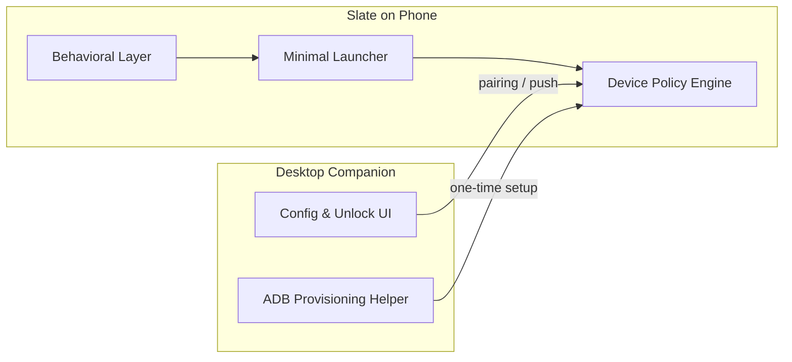
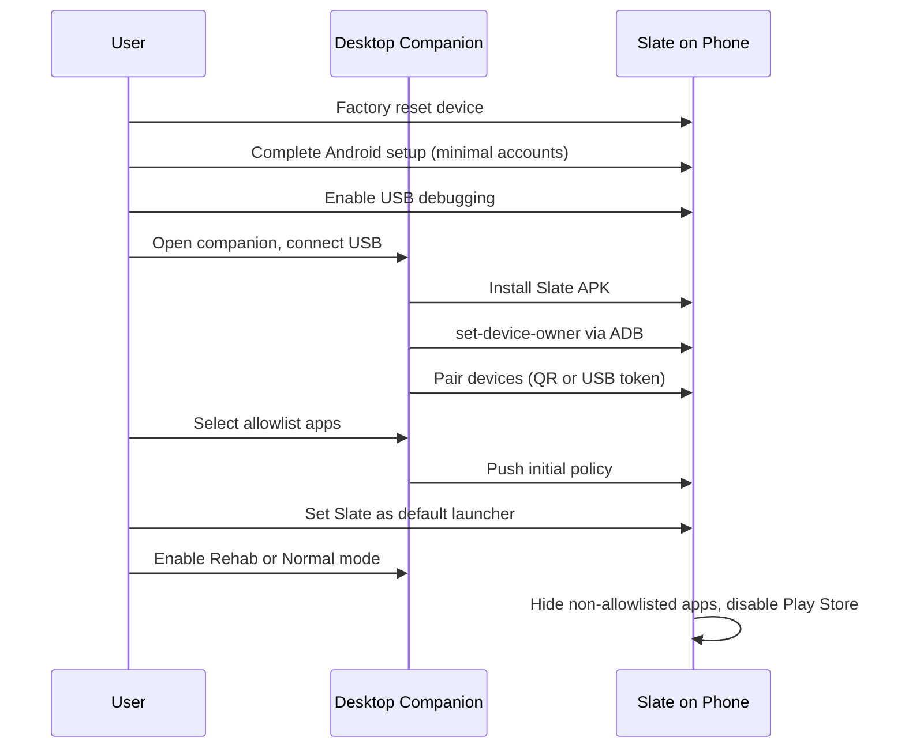

# Slate — Functional Specification

**Version:** 0.1  
**Status:** Draft  
**Target device:** Samsung Galaxy S22 (Android 12+, One UI 4+)  
**Last updated:** 2026-06-10

---

## 1. Overview

### 1.1 Product summary

Slate transforms a personal Android phone into a minimalist, distraction-resistant device. It combines three capabilities that existing products offer only in isolation:

1. **Hard enforcement** — Only allowlisted apps can run; new installs are blocked.
2. **Minimal UI** — A text-first launcher that makes the phone feel boring and intentional.
3. **Behavioral design** — Friction, schedules, and reflection beyond simple blocklists.

Slate is designed for a single user (the owner) who wants to break social media habits without buying a separate dumb phone.

### 1.2 Problem statement

Smartphone addiction is sustained by:

- Unlimited app availability and easy reinstall
- Visually stimulating home screens and notifications
- Blockers that can be disabled from the same device being protected

Soft solutions (launchers, Screen Time, Opal) fail when temptation is high because the bypass path is on the phone itself.

### 1.3 Product goals

| Goal | Success criteria |
|------|------------------|
| Eliminate social media access during locked periods | User cannot open blocked apps via launcher, recents, notifications, or sideload |
| Prevent new app installs | Play Store and sideloading disabled while locked |
| Reduce compulsive phone use | Measurable drop in pickups and non-essential app opens |
| Preserve essential utility | Phone, messages, maps, music, and camera always work |
| Make the phone feel minimal | Home screen has no icons, feeds, or badges |
| Resist self-bypass | Unlocking policy changes requires external device (desktop companion) |

### 1.4 Non-goals (v0.1)

- Mass-market Play Store distribution as a consumer app
- iOS support
- Cloud-based social features or analytics dashboards
- Physical NFC hardware (deferred to v2)
- Enterprise MDM / fleet management

---

## 2. User persona

**Primary user:** Adult smartphone owner (developer or power user) who:

- Recognizes social media as a habit problem, not a time-management problem
- Is willing to factory-reset and provision a device once for real lockdown
- Wants a Galaxy S22 to remain useful (maps, Spotify, messaging) without being a pocket casino
- Accepts that policy changes should be inconvenient by design

---

## 3. Competitive context

Slate intentionally combines patterns from:

| Product | Pattern adopted | Gap Slate fills |
|---------|-----------------|-----------------|
| **SHIFT (RETVRN)** | Desktop-controlled unlock; bypass-resistant device policy; Rehab mode | SHIFT does not provide a minimalist launcher experience |
| **minimalist phone** | Text-only home, mindful delays, schedules, grayscale | Can be uninstalled or bypassed via launcher switch |
| **Dumbphone** | Launch delay, notification quieting, double-tap lock | No install blocking or device-level enforcement |
| **Olauncher / KISS** | Search-first, ultra-light UI | No blocking or policy layer |

---

## 4. System components



### 4.1 Slate Android app

Single APK fulfilling:

- Default home launcher (minimal UI)
- Device Owner / Device Policy Controller (DPC)
- App launch interceptor
- Local policy store

### 4.2 Slate Desktop Companion

Web or desktop app used to:

- Complete initial device provisioning
- Manage allowlist and modes
- Authorize temporary unlocks
- Export/import configuration

The phone cannot permanently weaken Slate policy without companion authorization (in Rehab mode).

---

## 5. Operating modes

| Mode | Description | Typical use |
|------|-------------|-------------|
| **Normal** | Allowlist enforced; mindful delays active; Play Store disabled | Daily life |
| **Focus** | Stricter: browser disabled or domain-filtered; longer launch delays | Work blocks |
| **Sleep** | Only Phone, Clock, Alarm; DND encouraged | Night |
| **Rehab** | Maximum lockdown: no safe mode, no factory reset, no uninstall, no phone-side unlock | 30-day detox |
| **Maintenance** | Time-limited (default 15 min): Play Store and system settings accessible | OS updates, app installs |

### 5.1 Mode transition rules

| From | To | Authorization |
|------|-----|---------------|
| Any | Normal, Focus, Sleep | Desktop companion OR on-device schedule |
| Any | Rehab | Desktop companion + explicit confirmation |
| Rehab | Any other | Desktop companion + 48-hour cooldown (configurable) |
| Any | Maintenance | Desktop companion one-time token |

### 5.2 Mode behaviors

#### Normal
- Allowlisted apps visible on home and in search
- Mindful launch delay applies to Tier 2 apps (see §7)
- Play Store hidden and installs blocked
- Notifications filtered per §9

#### Focus
- All Normal rules, plus:
- Chrome/browser disabled OR limited to allowlisted domains
- Mindful delay increased (default 30s for all non-Phone apps)
- Recents cleared on mode entry

#### Sleep
- Home shows only: Phone, Clock
- All other apps blocked regardless of allowlist
- Scheduled auto-entry (default 10:00 PM – 7:00 AM, user-configurable via companion)

#### Rehab
- All Normal rules, plus:
- `DISALLOW_SAFE_BOOT` enabled
- `DISALLOW_FACTORY_RESET` enabled
- Uninstall of Slate blocked
- No on-phone settings UI for policy
- Unlock requests show "Use desktop companion" with no override

#### Maintenance
- Play Store visible for configured duration
- User restrictions relaxed for installs
- Auto-revert to previous mode when timer expires
- Audit log entry created

---

## 6. User flows

### 6.1 First-time setup



**Acceptance criteria:**
- Setup completable in under 30 minutes by a technical user
- Companion displays clear success/failure for each step
- Phone is usable for calls and messages immediately after setup

### 6.2 Daily use — open an app

1. User wakes phone → Slate home screen (clock + app list)
2. User taps **Spotify**
3. If mindful delay applies → full-screen countdown (e.g. 15s), skippable only in Normal mode with PIN (optional, off by default)
4. App launches
5. User presses Home → returns to Slate launcher (not Samsung launcher)

**Acceptance criteria:**
- No app icons on home screen (text labels only)
- Launch completes in under 3s after delay (excluding delay duration)

### 6.3 Blocked app attempt

1. User attempts to open Instagram (leftover install, notification, or deep link)
2. Slate intercepts launch
3. Full-screen overlay: **"Not available"** with single **OK** dismiss
4. No link to settings, uninstall, or override (in Rehab)

**Acceptance criteria:**
- Blocked app never reaches foreground
- Overlay appears within 500ms of launch attempt

### 6.4 Request policy change (Rehab mode)

1. User opens desktop companion
2. Authenticates (local password or OS keychain)
3. Selects "Unlock for 1 hour" or "Edit allowlist"
4. Confirms action
5. Phone receives policy update within 60s (LAN or push)

**Acceptance criteria:**
- Phone alone cannot complete this flow in Rehab mode
- All unlock events logged with timestamp

### 6.5 Scheduled Sleep mode

1. User configures Sleep schedule in companion (e.g. 22:00–07:00)
2. At 22:00, phone enters Sleep mode automatically
3. Home shows Phone + Clock only
4. At 07:00, reverts to previous mode

---

## 7. App tiers and default allowlist

### 7.1 Tier definitions

| Tier | Description | Home screen | Mindful delay |
|------|-------------|-------------|---------------|
| **Tier 1 — Essential** | Core utilities | Pinned | None |
| **Tier 2 — Allowed** | Useful but optional | Search only | Default 15s |
| **Tier 3 — Blocked** | Social, games, stores | Hidden | N/A — blocked |

### 7.2 Default allowlist (MVP)

| App | Tier | Package (reference) |
|-----|------|---------------------|
| Phone | 1 | `com.samsung.android.dialer` or `com.google.android.dialer` |
| Messages | 1 | `com.samsung.android.messaging` or `com.google.android.apps.messaging` |
| Maps | 1 | `com.google.android.apps.maps` |
| Spotify | 1 | `com.spotify.music` |
| Camera | 1 | `com.sec.android.app.camera` |
| Chrome | 2 | `com.android.chrome` |
| Calendar | 2 | `com.google.android.calendar` |
| Clock | 1 | Built into Slate launcher (system clock fallback) |
| Files / Gallery | 2 | Optional; disabled by default |

### 7.3 Default blocklist (always blocked in MVP)

- All social: Instagram, TikTok, X, Reddit, Facebook, Snapchat, Threads, etc.
- YouTube (`com.google.android.youtube`)
- Play Store (`com.android.vending`)
- Samsung Galaxy Store (`com.sec.android.app.samsungapps`)
- Game Launchers
- Samsung Free / Bixby feed (`com.samsung.android.app.spage`)
- All apps not on allowlist

### 7.4 Chrome policy

Configurable per mode:

| Policy | Normal | Focus | Sleep | Rehab |
|--------|--------|-------|-------|-------|
| Chrome disabled | No | Optional | Yes | Optional |
| Domain blocklist | Off | On | N/A | On |

Default domain blocklist includes: `instagram.com`, `tiktok.com`, `twitter.com`, `x.com`, `reddit.com`, `facebook.com`, `youtube.com`.

---

## 8. Launcher UI specification

### 8.1 Design principles

1. No app icons on the primary home view
2. Single calm color palette; no gradients or feeds
3. Large, readable typography
4. Generous whitespace
5. No notification badges on home screen
6. Minimal animation (fade only, &lt; 200ms)

### 8.2 Home screen layout

```
┌─────────────────────────────┐
│                             │
│         10:42               │  ← Primary clock (48–64sp)
│      Wednesday, Jun 10      │  ← Date (14–16sp, secondary color)
│                             │
│   Phone                     │  ← Tier 1 apps, 20–24sp
│   Messages                  │
│   Maps                      │
│   Spotify                   │
│   Camera                    │
│                             │
│   ─────────────────         │
│   Search                    │  ← Opens allowlist + search
│                             │
└─────────────────────────────┘
```

### 8.3 Search / all-apps screen

- Alphabetical list of Tier 1 + Tier 2 allowlisted apps
- Text-only rows
- Search filters by app name
- No suggestions, recents, or "recommended"

### 8.4 Mindful launch delay screen

```
┌─────────────────────────────┐
│                             │
│                             │
│            15               │  ← Countdown seconds
│                             │
│      Opening Spotify        │
│                             │
│                             │
└─────────────────────────────┘
```

- Background matches home theme
- No cancel button in Rehab mode
- Optional skip with PIN in Normal mode (companion-configured)

### 8.5 Blocked app overlay

```
┌─────────────────────────────┐
│                             │
│      Not available          │
│                             │
│   This app isn't part of    │
│   your Slate setup.         │
│                             │
│        [ OK ]               │
│                             │
└─────────────────────────────┘
```

- Neutral copy; no guilt language
- Single dismiss action

### 8.6 Themes

| Theme | Background | Primary text | Secondary text |
|-------|------------|--------------|----------------|
| **Paper Night** (default) | `#0F0F0F` | `#E8E4DF` | `#6B6560` |
| **Daylight** | `#F5F2ED` | `#2C2825` | `#8A847C` |

### 8.7 Gestures

| Gesture | Action |
|---------|--------|
| Tap app name | Launch (with delay if applicable) |
| Swipe up | Open search / all-apps |
| Double-tap empty area | Lock device |
| Triple-tap bottom-left corner | Admin PIN entry (hidden) |

### 8.8 Admin PIN screen (hidden)

- Enter PIN → view current mode, sync status, last policy update
- Does **not** allow allowlist edits in Rehab mode
- 5 failed attempts → 15-minute lockout

---

## 9. Notifications

### 9.1 Default policy

| Source | Behavior |
|--------|----------|
| Phone calls | Always show |
| SMS / RCS messages | Always show |
| Calendar reminders | Show |
| All other apps | Suppress on lock screen; no peek/popup |
| Blocked apps | Drop silently |

### 9.2 User overrides (via companion)

- Per-app notification allowlist
- "Quiet hours" aligned with Sleep schedule

---

## 10. Behavioral features

### 10.1 Mindful launch delay

- Configurable 0–60 seconds per tier
- Default: 0s Tier 1, 15s Tier 2
- Focus mode default: 30s all non-Phone apps

### 10.2 Grayscale mode (v1.1)

- Optional system-wide or per-app monochrome
- Activated via companion or schedule

### 10.3 Usage reflection (v1.1)

- End-of-day summary: "Chrome opened 8 times today"
- Shown once at configured time on launcher
- No gamification, streaks, or scores

### 10.4 App renaming (v1.1)

- User can rename labels (e.g. "Chrome" → "Internet")
- Cosmetic only; does not change package

---

## 11. Desktop companion functional requirements

### 11.1 Core features (MVP)

| ID | Requirement |
|----|-------------|
| DC-01 | Guide user through ADB Device Owner provisioning |
| DC-02 | Display pairing QR code; establish trusted channel with phone |
| DC-03 | Edit allowlist (add/remove packages by name search) |
| DC-04 | Switch modes (Normal, Focus, Sleep, Rehab, Maintenance) |
| DC-05 | Issue time-limited unlock tokens |
| DC-06 | Export policy as encrypted JSON backup |
| DC-07 | Import policy from backup |
| DC-08 | Show audit log (mode changes, unlocks, allowlist edits) |

### 11.2 Platforms (MVP)

- Web app runnable locally (localhost) with USB bridge for ADB
- macOS, Linux, Windows supported via browser + ADB

---

## 12. Security and privacy

| Requirement | Detail |
|-------------|--------|
| Local-first | Policy and usage data stay on device |
| No third-party analytics | MVP has zero telemetry |
| Encrypted pairing | QR pairing uses one-time key exchange |
| Companion auth | Password or system keychain |
| Audit log | Local on phone; exportable via companion |

---

## 13. Edge cases and constraints

| Scenario | Expected behavior |
|----------|-------------------|
| Incoming call during blocked app overlay | Overlay dismissed; call UI shown |
| Emergency call (911) | Always allowed |
| Alarm fires during Sleep | Alarm app temporarily allowed |
| Android OS update | User uses Maintenance mode |
| Banking app detects Device Owner | Document known incompatibilities; user tests |
| Spotify offline | Works without change |
| Device reboot | Slate auto-starts as launcher; policy persists |
| Battery death | No policy loss |

---

## 14. MVP scope checklist

### In scope

- [ ] Device Owner provisioning
- [ ] Minimal text launcher (Tier 1 home + search)
- [ ] Allowlist enforcement (hide + block launch)
- [ ] Play Store disabled in Normal+ modes
- [ ] Mindful launch delay
- [ ] Modes: Normal, Focus, Sleep, Rehab, Maintenance
- [ ] Desktop companion: provisioning, allowlist, mode switch, unlock
- [ ] Blocked app overlay
- [ ] Notification filtering (basic)
- [ ] Paper Night theme

### Out of scope (post-MVP)

- NFC hardware unlock puck
- Chrome domain filtering (v1.1)
- Grayscale mode (v1.1)
- Usage reflection (v1.1)
- Play Store distribution
- Multi-device sync

---

## 15. Acceptance criteria (MVP release)

1. User can complete setup from factory reset to locked-down phone using companion
2. Non-allowlisted apps cannot be opened by any path tested (launcher, recents, notification tap)
3. Play Store cannot install apps in Normal mode
4. Slate cannot be uninstalled in Rehab mode without companion + Maintenance flow
5. Home screen matches wireframe: clock, text app list, no icons
6. Desktop companion can switch modes and push updates within 60s on LAN
7. Phone and Messages work without interruption at all times

---

## 16. Glossary

| Term | Definition |
|------|------------|
| **Allowlist** | Set of package names permitted to run |
| **Device Owner** | Android privilege granting Slate system-level policy control |
| **DPC** | Device Policy Controller — Slate's admin component |
| **Mindful delay** | Forced pause before app launch |
| **Rehab mode** | Maximum restriction mode for extended detox |
| **Companion** | Desktop/web app for policy management |

---

## 17. Document history

| Version | Date | Changes |
|---------|------|---------|
| 0.1 | 2026-06-10 | Initial functional specification |
