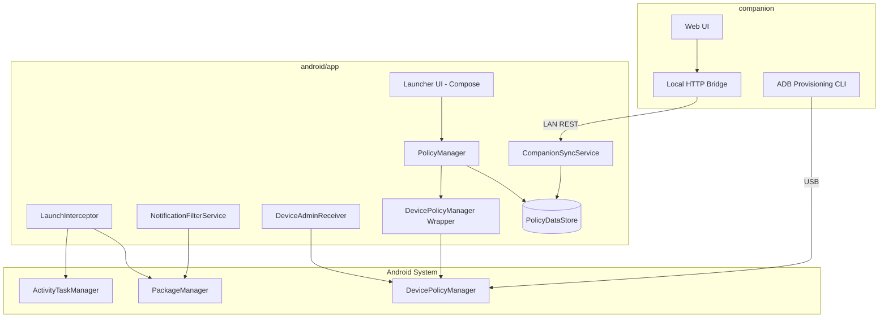
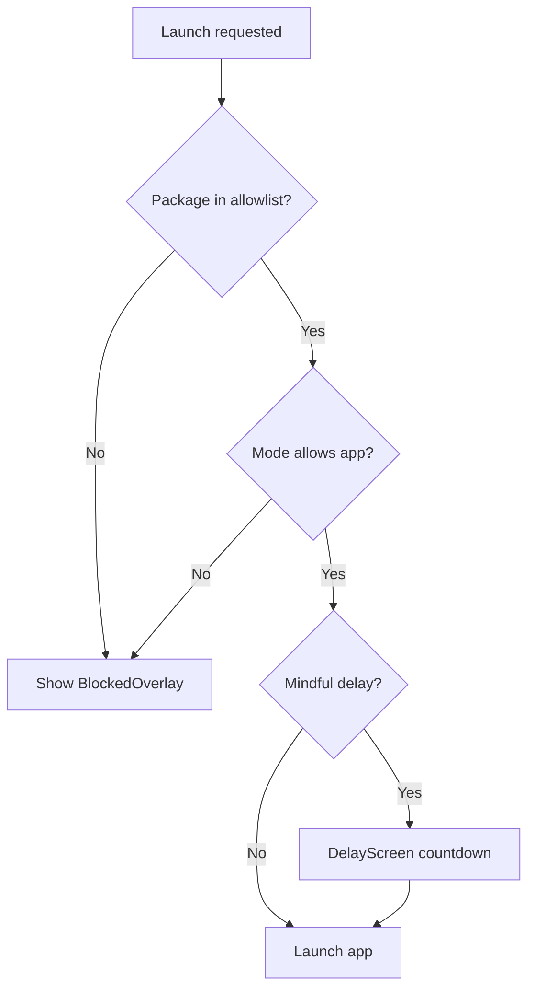
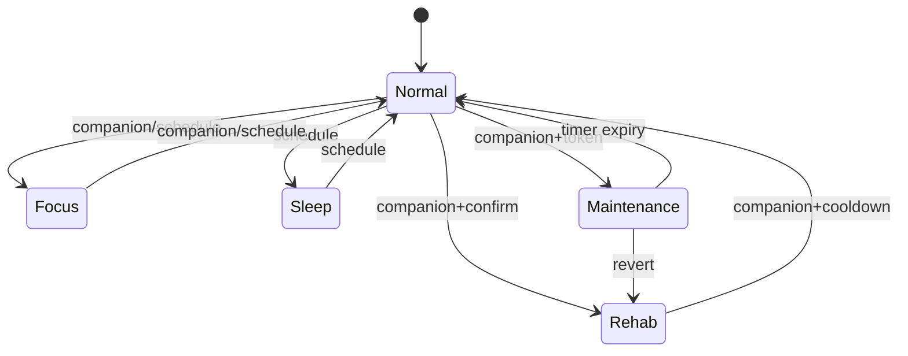
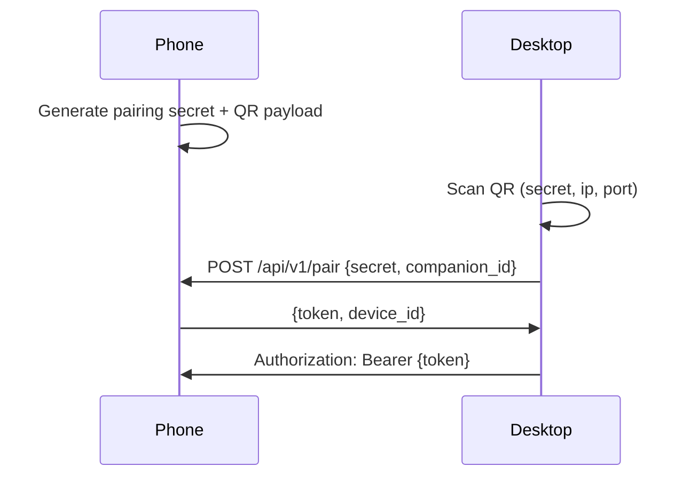

# Slate — Technical Specification

**Version:** 0.1  
**Status:** Draft  
**Companion to:** [functional-spec.md](./functional-spec.md)  
**Last updated:** 2026-06-10

---

## 1. Architecture overview

### 1.1 Monorepo layout (target)

```
slate/
├── android/                    # Slate Android app (Kotlin + Compose)
│   ├── app/
│   └── build.gradle.kts
├── companion/                  # Desktop companion (web + local bridge)
│   ├── web/                    # Next.js or Vite SPA
│   └── bridge/                 # Optional Node ADB helper
├── docs/
│   ├── functional-spec.md
│   └── technical-spec.md
└── README.md
```

### 1.2 High-level component diagram



### 1.3 Technology choices

| Layer | Technology | Rationale |
|-------|------------|-----------|
| Android language | Kotlin 2.0+ | Standard for modern Android |
| Android UI | Jetpack Compose | Fast iteration on minimal UI |
| Android min SDK | 31 (Android 12) | S22 ships Android 12+; simplifies APIs |
| Android target SDK | 34 | Current stable; test on 35 before release |
| Persistence | DataStore (Proto) | Type-safe policy storage |
| DI | Hilt | Standard Android DI |
| Companion UI | Vite + React (or Next.js) | Fast local web UI |
| Companion bridge | Node.js + `adb` CLI | USB provisioning and LAN sync |
| IPC | HTTPS REST on LAN | Simple; no cloud required for MVP |

---

## 2. Android application

### 2.1 Application identity

| Field | Value |
|-------|-------|
| Application ID | `com.slate.phone` |
| Namespace | `com.slate.phone` |
| App name (display) | Slate |
| Device admin component | `com.slate.phone/.admin.SlateDeviceAdminReceiver` |
| Launcher activity | `com.slate.phone/.launcher.LauncherActivity` |

### 2.2 Required manifest capabilities

```xml
<!-- Permissions (indicative — finalize during implementation) -->
<uses-permission android:name="android.permission.INTERNET" />
<uses-permission android:name="android.permission.ACCESS_NETWORK_STATE" />
<uses-permission android:name="android.permission.QUERY_ALL_PACKAGES"
    tools:ignore="QueryAllPackagesPermission" />
<uses-permission android:name="android.permission.POST_NOTIFICATIONS" />
<uses-permission android:name="android.permission.RECEIVE_BOOT_COMPLETED" />
<uses-permission android:name="android.permission.FOREGROUND_SERVICE" />
<uses-permission android:name="android.permission.FOREGROUND_SERVICE_SPECIAL_USE" />
```

#### Device admin receiver

```xml
<receiver
    android:name=".admin.SlateDeviceAdminReceiver"
    android:permission="android.permission.BIND_DEVICE_ADMIN"
    android:exported="true">
    <meta-data
        android:name="android.app.device_admin"
        android:resource="@xml/device_admin_policies" />
    <intent-filter>
        <action android:name="android.app.action.DEVICE_ADMIN_ENABLED" />
    </intent-filter>
</receiver>
```

#### Launcher activity

```xml
<activity
    android:name=".launcher.LauncherActivity"
    android:exported="true"
    android:launchMode="singleTask"
    android:stateNotSaved="true"
    android:windowSoftInputMode="adjustPan">
    <intent-filter>
        <action android:name="android.intent.action.MAIN" />
        <category android:name="android.intent.category.HOME" />
        <category android:name="android.intent.category.DEFAULT" />
        <category android:name="android.intent.action.LAUNCHER" />
    </intent-filter>
</activity>
```

### 2.3 Module structure

```
com.slate.phone/
├── admin/
│   ├── SlateDeviceAdminReceiver.kt
│   └── DeviceOwnerManager.kt
├── policy/
│   ├── PolicyModels.kt
│   ├── PolicyRepository.kt
│   ├── PolicyEnforcer.kt
│   └── ModeController.kt
├── launcher/
│   ├── LauncherActivity.kt
│   ├── LauncherViewModel.kt
│   ├── ui/
│   │   ├── HomeScreen.kt
│   │   ├── SearchScreen.kt
│   │   ├── DelayScreen.kt
│   │   └── BlockedOverlay.kt
│   └── theme/
│       └── SlateTheme.kt
├── interceptor/
│   ├── LaunchInterceptorService.kt      # AccessibilityService (fallback)
│   └── PackageLaunchBlocker.kt            # Primary: Device Owner + task listener
├── notifications/
│   └── NotificationFilterService.kt
├── sync/
│   ├── CompanionSyncService.kt
│   └── PairingManager.kt
├── boot/
│   └── BootReceiver.kt
└── di/
    └── AppModule.kt
```

---

## 3. Device Owner provisioning

### 3.1 Prerequisites

1. Device factory reset
2. No work profile on device
3. Slate APK installed (`adb install slate-release.apk`)
4. USB debugging enabled
5. Ideally no Google account added before provisioning (account can be added after)

### 3.2 Provisioning command

```bash
adb shell dpm set-device-owner com.slate.phone/.admin.SlateDeviceAdminReceiver
```

**Expected success output:**
```
Success: Device owner set to package com.slate.phone
Component: {com.slate.phone/com.slate.phone.admin.SlateDeviceAdminReceiver}
```

### 3.3 Post-provisioning initialization (`DeviceOwnerManager`)

Executed once when device owner is confirmed:

```kotlin
// Pseudocode — implementation reference
fun initializeDeviceOwner() {
    val dpm = devicePolicyManager
    val admin = adminComponent

    // 1. Set Slate as lock task package
    dpm.setLockTaskPackages(admin, arrayOf(packageName))

    // 2. Set Slate as preferred home (persistent preferred activities)
    dpm.addPersistentPreferredActivity(
        admin,
        homeIntentFilter,
        ComponentName(packageName, LauncherActivity::class.java.name)
    )

    // 3. Apply user restrictions for Normal mode
    applyModeRestrictions(Mode.NORMAL)

    // 4. Start lock task in launcher
    launcherActivity.startLockTask()
}
```

### 3.4 User restrictions by mode

| Restriction constant | Normal | Focus | Sleep | Rehab | Maintenance |
|---------------------|--------|-------|-------|-------|-------------|
| `DISALLOW_INSTALL_APPS` | ✓ | ✓ | ✓ | ✓ | ✗ |
| `DISALLOW_UNINSTALL_APPS` | ✓ | ✓ | ✓ | ✓ | ✗ |
| `DISALLOW_INSTALL_UNKNOWN_SOURCES` | ✓ | ✓ | ✓ | ✓ | ✗ |
| `DISALLOW_SAFE_BOOT` | ✗ | ✗ | ✗ | ✓ | ✗ |
| `DISALLOW_FACTORY_RESET` | ✗ | ✗ | ✗ | ✓ | ✗ |
| `DISALLOW_ADD_USER` | ✓ | ✓ | ✓ | ✓ | ✓ |
| `DISALLOW_MOUNT_PHYSICAL_MEDIA` | ✗ | ✗ | ✗ | ✓ | ✗ |

Applied via:
```kotlin
dpm.addUserRestriction(admin, UserManager.DISALLOW_INSTALL_APPS)
dpm.clearUserRestriction(admin, UserManager.DISALLOW_INSTALL_APPS)
```

---

## 4. Policy data model

### 4.1 Proto schema (`policy.proto`)

```protobuf
syntax = "proto3";

package com.slate.policy;

message SlatePolicy {
  int32 version = 1;
  Mode current_mode = 2;
  Mode previous_mode = 3;
  repeated string allowlist_packages = 4;
  repeated string blocklist_packages = 5;
  map<string, AppTier> app_tiers = 6;
  MindfulDelayConfig mindful_delay = 7;
  SleepSchedule sleep_schedule = 8;
  NotificationConfig notifications = 9;
  ChromePolicy chrome = 10;
  int64 maintenance_expires_at = 11;
  int64 rehab_unlock_available_at = 12;
  repeated AuditEntry audit_log = 13;
}

enum Mode {
  MODE_UNSPECIFIED = 0;
  NORMAL = 1;
  FOCUS = 2;
  SLEEP = 3;
  REHAB = 4;
  MAINTENANCE = 5;
}

enum AppTier {
  TIER_UNSPECIFIED = 0;
  TIER_1 = 1;
  TIER_2 = 2;
  TIER_BLOCKED = 3;
}

message MindfulDelayConfig {
  int32 tier1_delay_seconds = 1;
  int32 tier2_delay_seconds = 2;
  int32 focus_delay_seconds = 3;
  bool allow_pin_skip = 4;
}

message SleepSchedule {
  bool enabled = 1;
  int32 start_minutes = 2;  // minutes from midnight, e.g. 1320 = 22:00
  int32 end_minutes = 3;
}

message NotificationConfig {
  repeated string allowed_packages = 1;
  bool suppress_lock_screen = 2;
}

message ChromePolicy {
  bool disabled = 1;
  repeated string blocked_domains = 2;
}

message AuditEntry {
  int64 timestamp = 1;
  string action = 2;
  string detail = 3;
  string source = 4;  // "companion" | "schedule" | "local"
}
```

### 4.2 Default policy (factory)

```json
{
  "version": 1,
  "current_mode": "NORMAL",
  "allowlist_packages": [
    "com.samsung.android.dialer",
    "com.google.android.dialer",
    "com.samsung.android.messaging",
    "com.google.android.apps.messaging",
    "com.google.android.apps.maps",
    "com.spotify.music",
    "com.sec.android.app.camera",
    "com.android.chrome",
    "com.google.android.calendar"
  ],
  "blocklist_packages": [
    "com.android.vending",
    "com.sec.android.app.samsungapps",
    "com.google.android.youtube",
    "com.instagram.android",
    "com.zhiliaoapp.musically",
    "com.twitter.android",
    "com.reddit.frontpage",
    "com.facebook.katana",
    "com.snapchat.android",
    "com.samsung.android.app.spage"
  ],
  "mindful_delay": {
    "tier1_delay_seconds": 0,
    "tier2_delay_seconds": 15,
    "focus_delay_seconds": 30,
    "allow_pin_skip": false
  },
  "sleep_schedule": {
    "enabled": true,
    "start_minutes": 1320,
    "end_minutes": 420
  }
}
```

---

## 5. App enforcement

### 5.1 Enforcement stack (priority order)



### 5.2 Primary enforcement: PackageManager hide

For packages not on allowlist (Device Owner required):

```kotlin
dpm.setApplicationHidden(admin, packageName, hidden = true)
```

- Hidden apps do not appear in launcher, recents (with lock task), or settings app list
- Reversed in Maintenance mode for management

### 5.3 Secondary enforcement: Lock task mode

```kotlin
// In LauncherActivity.onResume()
if (deviceOwnerManager.isDeviceOwner()) {
    startLockTask()
}
```

Lock task properties (API 28+):

```kotlin
dpm.setLockTaskFeatures(
    admin,
    DevicePolicyManager.LOCK_TASK_FEATURE_NONE
)
```

Disables status bar expansion, recents, and home button escape.

**Exception handling:** Home button should return to Slate launcher (persistent preferred activity).

### 5.4 Tertiary enforcement: Task stack listener

Register `TaskStackListener` or use `ActivityManager` callbacks (Device Owner) to detect foreground package changes:

```kotlin
fun onForegroundAppChanged(packageName: String) {
    if (!policyRepository.isAllowed(packageName, currentMode)) {
        launchBlockedOverlay(packageName)
        sendAppToBackground(packageName)
    }
}
```

### 5.5 Fallback: AccessibilityService

Used only if task listener misses edge cases (notification trampoline launches):

- Service: `LaunchInterceptorService`
- Event: `TYPE_WINDOW_STATE_CHANGED`
- Disabled by default on devices where primary enforcement is sufficient
- User must explicitly enable during setup if needed

**Manifest:**
```xml
<service
    android:name=".interceptor.LaunchInterceptorService"
    android:permission="android.permission.BIND_ACCESSIBILITY_SERVICE"
    android:exported="false">
    <intent-filter>
        <action android:name="android.accessibilityservice.AccessibilityService" />
    </intent-filter>
    <meta-data
        android:name="android.accessibilityservice"
        android:resource="@xml/accessibility_service_config" />
</service>
```

---

## 6. Launcher implementation

### 6.1 Activity lifecycle

| Event | Action |
|-------|--------|
| `onCreate` | Load policy; render HomeScreen |
| `onResume` | `startLockTask()` if device owner; refresh app list |
| `onNewIntent` | Handle HOME intent → stay on home |
| `onBackPressed` | No-op on home (do not exit launcher) |

### 6.2 App resolution

```kotlin
data class SlateApp(
    val packageName: String,
    val displayName: String,   // from PackageManager or custom rename
    val tier: AppTier,
    val launchIntent: Intent
)

fun resolveAllowlistedApps(policy: SlatePolicy): List<SlateApp> {
    return policy.allowlist_packages
        .mapNotNull { pkg -> resolveLaunchableApp(pkg) }
        .filter { policy.appTiers[it.packageName] != TIER_BLOCKED }
        .sortedBy { it.displayName.lowercase() }
}
```

### 6.3 Launch flow

```kotlin
suspend fun launchApp(app: SlateApp) {
    val delay = policyRepository.getDelayFor(app)
    if (delay > 0) {
        navController.navigate(DelayScreen(app, delay))
    } else {
        startActivity(app.launchIntent)
    }
}
```

### 6.4 Compose theme tokens

```kotlin
object SlateColors {
    val Background = Color(0xFF0F0F0F)
    val TextPrimary = Color(0xFFE8E4DF)
    val TextSecondary = Color(0xFF6B6560)
    val Accent = Color(0xFFC4A882)
}

object SlateTypography {
    val Clock = TextStyle(fontSize = 56.sp, fontWeight = FontWeight.Light)
    val AppName = TextStyle(fontSize = 22.sp, fontWeight = FontWeight.Normal)
    val Date = TextStyle(fontSize = 15.sp, fontWeight = FontWeight.Normal)
}
```

Font: bundled **Inter** or **DM Sans** (TTF in `res/font/`).

---

## 7. Mode controller

### 7.1 State machine



### 7.2 Implementation

```kotlin
class ModeController @Inject constructor(
    private val policyRepository: PolicyRepository,
    private val deviceOwnerManager: DeviceOwnerManager,
    private val auditLog: AuditLog
) {
    suspend fun transitionTo(mode: Mode, source: String) {
        val current = policyRepository.getPolicy()
        if (current.current_mode == Mode.REHAB && mode != Mode.MAINTENANCE) {
            requireRehabUnlock()
        }
        deviceOwnerManager.applyModeRestrictions(mode)
        policyRepository.updateMode(mode, previous = current.current_mode)
        auditLog.record("mode_change", "${current.current_mode} -> $mode", source)
    }
}
```

### 7.3 Sleep schedule

- Use `WorkManager` periodic worker checking every 15 minutes
- Worker compares current time to `sleep_schedule` in policy
- Transitions only between Normal ↔ Sleep (stores `previous_mode`)

---

## 8. Notification filtering

### 8.1 Approach (MVP)

`NotificationListenerService` implementation:

```kotlin
class NotificationFilterService : NotificationListenerService() {
    override fun onNotificationPosted(sbn: StatusBarNotification) {
        val pkg = sbn.packageName
        if (!policyRepository.isNotificationAllowed(pkg)) {
            cancelNotification(sbn.key)
        }
    }
}
```

Requires user grant: `Settings.ACTION_NOTIFICATION_LISTENER_SETTINGS`

During setup, companion flow prompts user to enable this permission.

### 8.2 Always-allowed packages (default)

- `com.samsung.android.dialer`
- `com.google.android.dialer`
- `com.samsung.android.messaging`
- `com.google.android.apps.messaging`
- `com.google.android.calendar`

---

## 9. Companion sync protocol

### 9.1 Transport

- **MVP:** HTTP REST over local network
- Phone runs embedded Ktor server on port `7847` (configurable)
- TLS optional for MVP (localhost/LAN trusted network); TLS required for v1.1

### 9.2 Pairing flow



**QR payload:**
```json
{
  "v": 1,
  "ip": "192.168.1.42",
  "port": 7847,
  "secret": "<32-byte-base64>",
  "device_id": "<uuid>"
}
```

### 9.3 REST API

| Method | Path | Auth | Description |
|--------|------|------|-------------|
| `POST` | `/api/v1/pair` | Secret | Establish companion token |
| `GET` | `/api/v1/policy` | Bearer | Fetch current policy |
| `PUT` | `/api/v1/policy` | Bearer | Replace policy (partial merge) |
| `POST` | `/api/v1/mode` | Bearer | `{ "mode": "FOCUS" }` |
| `POST` | `/api/v1/unlock` | Bearer | `{ "duration_minutes": 60 }` |
| `GET` | `/api/v1/status` | Bearer | Device owner, mode, sync time |
| `GET` | `/api/v1/audit` | Bearer | Audit log entries |
| `GET` | `/api/v1/apps` | Bearer | Installed apps (for allowlist UI) |

### 9.4 Policy update request

```json
PUT /api/v1/policy
Authorization: Bearer <token>
Content-Type: application/json

{
  "allowlist_packages": ["com.spotify.music", "..."],
  "mindful_delay": { "tier2_delay_seconds": 20 },
  "sleep_schedule": { "enabled": true, "start_minutes": 1320, "end_minutes": 420 }
}
```

Phone validates, persists to DataStore, triggers `PolicyEnforcer.apply()`.

### 9.5 Rehab unlock cooldown

When exiting Rehab:
- Phone sets `rehab_unlock_available_at = now + 48h` on request
- `POST /api/v1/mode {"mode": "NORMAL"}` returns `409` until cooldown elapsed
- Companion shows remaining time

---

## 10. Desktop companion

### 10.1 Architecture

```
companion/
├── web/                        # Vite + React + TypeScript
│   ├── src/
│   │   ├── pages/
│   │   │   ├── Setup.tsx       # ADB provisioning wizard
│   │   │   ├── Dashboard.tsx   # Mode + status
│   │   │   ├── Allowlist.tsx   # App picker
│   │   │   └── Audit.tsx
│   │   └── api/slateClient.ts
│   └── package.json
└── bridge/
    ├── server.ts               # Optional: proxies ADB + serves web
    └── adb.ts                  # install apk, set-device-owner
```

### 10.2 ADB bridge commands

| Command | Purpose |
|---------|---------|
| `adb devices` | Detect connected phone |
| `adb install -r slate.apk` | Install/update Slate |
| `adb shell dpm set-device-owner ...` | Provision device owner |
| `adb shell am start -n com.slate.phone/.launcher.LauncherActivity` | Open launcher |

### 10.3 Setup wizard steps (web UI)

1. Connect phone via USB
2. Check `adb devices`
3. Install APK
4. Run `set-device-owner`
5. Display pairing QR from phone (user opens hidden admin on phone, or phone shows QR on first launch)
6. Scan / enter pairing code
7. Configure allowlist
8. Push policy → choose initial mode

---

## 11. Boot and recovery

### 11.1 Boot receiver

```kotlin
class BootReceiver : BroadcastReceiver() {
    override fun onReceive(context: Context, intent: Intent) {
        if (intent.action == Intent.ACTION_BOOT_COMPLETED) {
            context.startActivity(
                Intent(context, LauncherActivity::class.java)
                    .addFlags(Intent.FLAG_ACTIVITY_NEW_TASK)
            )
            PolicyEnforcer(context).applyCurrentPolicy()
        }
    }
}
```

### 11.2 Crash recovery

- If launcher crashes, boot receiver restarts it
- `startLockTask()` re-applied in `onResume`
- WorkManager re-schedules sleep checker on boot

### 11.3 Factory reset escape hatch

In non-Rehab mode:
- Companion can issue Maintenance → user can factory reset from settings

In Rehab mode:
- Factory reset blocked until Rehab exited via companion + cooldown

**Emergency:** Physical factory reset via recovery mode (hardware keys) — document as unavoidable Android limitation; Rehab mode blocks UI path only.

---

## 12. Samsung Galaxy S22 specifics

### 12.1 Known packages to block by default

| Package | App |
|---------|-----|
| `com.samsung.android.app.spage` | Samsung Free |
| `com.sec.android.app.samsungapps` | Galaxy Store |
| `com.samsung.android.game.gamehome` | Game Launcher |
| `com.android.vending` | Play Store |
| `com.samsung.android.bixby.agent` | Bixby |
| `com.microsoft.skydrive` | OneDrive (optional) |

### 12.2 Dialer / messages variance

S22 may use Samsung or Google apps depending on region/carrier. Setup wizard should detect installed dialer/messaging and pre-populate allowlist.

```kotlin
fun detectDialerPackage(pm: PackageManager): String? {
    val intent = Intent(Intent.ACTION_DIAL)
    return pm.resolveActivity(intent, 0)?.activityInfo?.packageName
}
```

### 12.3 One UI considerations

- Disable "Swipe down for notification panel" via lock task features
- Samsung Knox may coexist; Slate does not use Knox SDK in MVP
- Test on One UI 5 (Android 13) and One UI 6 (Android 14)

---

## 13. Build and distribution

### 13.1 Android build

```bash
cd android
./gradlew assembleRelease
# Output: android/app/build/outputs/apk/release/app-release.apk
```

- Release signing via `keystore.properties` (not committed)
- Debug builds skip Device Owner (mock policy mode for UI dev)

### 13.2 Debug / emulator mode

When not device owner, app runs in **dev mode**:

- Launcher UI functional
- Policy enforcement simulated (toast instead of block)
- Banner: "Dev mode — not device owner"

### 13.3 Distribution

- APK sideload via companion (not Play Store for MVP)
- Document SHA-256 fingerprint for verification

---

## 14. Testing strategy

### 14.1 Unit tests

| Area | Tests |
|------|-------|
| `PolicyRepository` | Mode transitions, allowlist checks |
| `ModeController` | Rehab cooldown, Maintenance expiry |
| `MindfulDelay` | Correct delay per tier/mode |

### 14.2 Instrumented tests (device required)

| ID | Test |
|----|------|
| T-01 | Device Owner provisioning succeeds |
| T-02 | Non-allowlisted app launch blocked |
| T-03 | Play Store hidden in Normal mode |
| T-04 | `startLockTask` prevents recents escape |
| T-05 | Boot → launcher auto-start |
| T-06 | Companion policy push updates allowlist |
| T-07 | Sleep schedule triggers at configured time |
| T-08 | Incoming call interrupts blocked overlay |

### 14.3 Manual QA checklist

- [ ] Factory reset → full setup flow
- [ ] Attempt Instagram launch from notification
- [ ] Attempt Safe Mode boot (Rehab)
- [ ] Spotify playback + lock screen
- [ ] Google Maps navigation
- [ ] Maintenance → install app → revert

---

## 15. Security considerations

| Topic | Mitigation |
|-------|------------|
| Companion API on LAN | Bearer token; optional PIN on phone for pairing |
| Token storage | EncryptedSharedPreferences on phone |
| Policy tampering | Device Owner prevents other apps modifying DataStore |
| ADB attack surface | Rehab blocks USB debugging disable (via `DISALLOW_DEBUGGING_FEATURES` — evaluate on S22) |
| Backup extraction | `android:allowBackup="false"` in manifest |

---

## 16. MVP implementation order

```mermaid
gantt
    title Slate MVP Build Order
    dateFormat X
    axisFormat %s

    section Android Core
    Project scaffold + Compose theme     :a1, 0, 1
    DeviceAdminReceiver + Owner check      :a2, 1, 2
  Policy DataStore + models              :a3, 2, 3
    Launcher UI (home + search)          :a4, 3, 4
    PolicyEnforcer (hide packages)       :a5, 4, 5
    Lock task + launch flow              :a6, 5, 6
    Blocked overlay + delay screen       :a7, 6, 7
    ModeController                       :a8, 7, 8
    Companion sync server (Ktor)         :a9, 8, 9
    Notification filter                  :a10, 9, 10
    Boot receiver + sleep worker         :a11, 10, 11

    section Companion
    Web scaffold + API client            :b1, 3, 4
    ADB setup wizard                     :b2, 5, 6
    Allowlist editor                     :b3, 7, 8
    Mode dashboard                       :b4, 8, 9
```



### Sprint breakdown

| Sprint | Deliverable |
|--------|-------------|
| **S1** | Android scaffold, theme, home screen (static app list) |
| **S2** | Device Owner provisioning + package hide |
| **S3** | Lock task, launch flow, blocked overlay |
| **S4** | Policy DataStore, mode controller |
| **S5** | Companion web: setup wizard + policy push |
| **S6** | Sleep schedule, notifications, polish + S22 QA |

---

## 17. Open technical questions

| # | Question | Default assumption |
|---|----------|-------------------|
| 1 | Keep Google account on device post-provision? | Yes — required for Maps/Spotify |
| 2 | Use AccessibilityService in MVP? | Only as fallback; test without first |
| 3 | Ktor vs NanoHTTPD for sync server? | Ktor |
| 4 | PIN hash storage for admin? | bcrypt via Android Security crypto |
| 5 | Chrome domain blocking in MVP? | Defer to v1.1; disable Chrome in Focus instead |

---

## 18. Document history

| Version | Date | Changes |
|---------|------|---------|
| 0.1 | 2026-06-10 | Initial technical specification |
